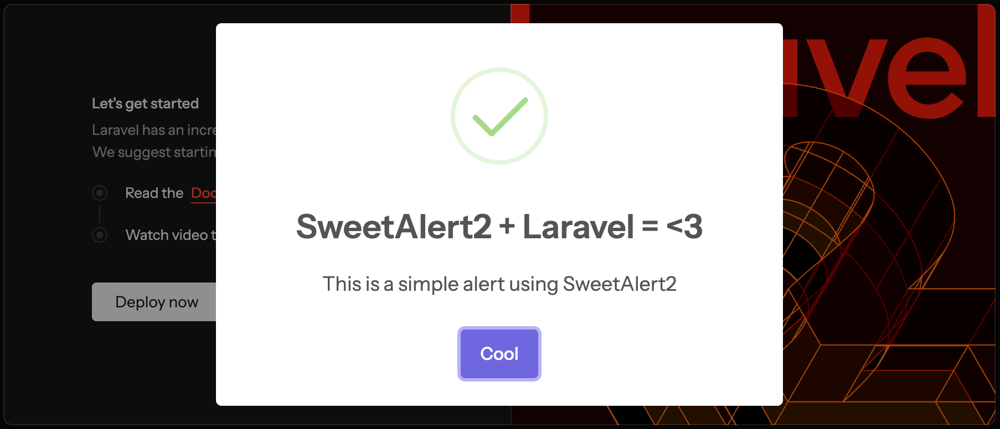

# Installation

---

```sh
composer require sweetalert2/laravel
```

Include the SweetAlert2 template in your layout file (usually `resources/views/layouts/app.blade.php`):

```blade
@include('sweetalert2::index')
```

# Usage

---

## Laravel Controllers, Middleware, Views etc.

You can now call `Swal::fire()` or any of the available helper methods anywhere in your Laravel application (controllers, middleware, etc.) to show a SweetAlert2 alert:

```php
use SweetAlert2\Laravel\Swal;

// same as `Swal.fire()` in JS, same options: https://sweetalert2.github.io/#configuration
Swal::fire([
    'title' => 'Laravel + SweetAlert2 = <3',
    'text' => 'This is a simple alert using SweetAlert2',
    'icon' => 'success',
    'confirmButtonText' => 'Cool'
]);
```

The full list of options can be found in the [SweetAlert2 documentation](https://sweetalert2.github.io/#configuration).

### Helpers

Available Laravel helper methods:

```php
// with a custom icon
Swal::success([
    'title' => 'Popup with a success icon',
]);
Swal::error([
    'title' => 'Popup with an error icon',
]);
Swal::warning([
    'title' => 'Popup with a warning icon',
]);
Swal::info([
    'title' => 'Popup with an info icon',
]);
Swal::question([
    'title' => 'Popup with a question icon',
]);

// or a toast
Swal::toast([
    'title' => 'Toast',
]);

// or a toast with a custom icon
Swal::toastSuccess([
    'title' => 'Toast with a success icon',
]);
Swal::toastError([
    'title' => 'Toast with an error icon',
]);
Swal::toastWarning([
    'title' => 'Toast with a warning icon',
]);
Swal::toastInfo([
    'title' => 'Toast with an info icon',
]);
Swal::toastQuestion([
    'title' => 'Toast with a question icon',
]);
```



---

## Livewire Components

You can now call `$this->swalFire` or any of the available helper methods in your Livewire component to show realtime popups and toasts:

#### LivewireExample.php

```php
use Livewire\Component;
use SweetAlert2\Laravel\Traits\WithSweetAlert;

class LivewireExample extends Component
{
    use WithSweetAlert;
    
    public function save(): void
    {
        // same as `Swal.fire()` in JS, same options: https://sweetalert2.github.io/#configuration
        $this->swalFire([
            'title' => 'Saved successfully!',
            'text' => 'The save method was called successfully!',
            'icon' => 'success',
            'confirmButtonText' => 'Lovely'
        ]);
    }
}
```

The full list of options can be found in the [SweetAlert2 documentation](https://sweetalert2.github.io/#configuration).

#### livewire-example.blade.php
```html
<div>
    <button type="button" wire:click="save">Save</button>
</div>
```

### Helpers

Available Livewire helper methods:

```php
// with a custom icon
$this->swalSuccess([
    'title' => 'Popup with a success icon',
]);
$this->swalError([
    'title' => 'Popup with an error icon',
]);
$this->swalWarning([
    'title' => 'Popup with a warning icon',
]);
$this->swalInfo([
    'title' => 'Popup with an info icon',
]);
$this->swalQuestion([
    'title' => 'Popup with a question icon',
]);

// or a toast
$this->swalToast([
    'title' => 'Toast',
]);

// or a toast with a custom icon
$this->swalToastSuccess([
    'title' => 'Toast with a success icon',
]);
$this->swalToastError([
    'title' => 'Toast with an error icon',
]);
$this->swalToastWarning([
    'title' => 'Toast with a warning icon',
]);
$this->swalToastInfo([
    'title' => 'Toast with an info icon',
]);
$this->swalToastQuestion([
    'title' => 'Toast with a question icon',
]);
```

# FAQ

---

## 1. How is this different to the [realrashid/sweet-alert](https://github.com/realrashid/sweet-alert) package?

The `realrashid/sweet-alert` package is too opinionated and too complex: facade, midddleware, adding vendor files, whatnot 🤯. And all that with 0 tests.

This package is simple, straightforward, and unopinionated. Its API is aimed to be as close as possible to the original [sweetalert2](https://sweetalert2.github.io/#configuration).

It simply provides a way to use SweetAlert2 in your Laravel or Livewire application without touching JS or CSS files.

## 2. How does it work?

Depending on whether you use the Swal class or the WithSweetAlert trait, within either a Laravel only or Livewire context, the behaviour is slightly different.

### Laravel controllers, middleware, views etc

> - The `Swal::fire()` or `$this->swalFire()` method will pass the options to the [flashed session](https://laravel.com/docs/12.x/session#flash-data).
> - The blade partial template will check if there is any flashed session data and will render the SweetAlert2 popup.

### Livewire components

> #### Realtime
> - The `$this->swalFire()` method will dispatch a [Livewire event](https://livewire.laravel.com/docs/events) with the options to the browser window within the current request (this also works on subsequent update requests).
> - The blade partial template will listen for the Livewire event and will render the SweetAlert2 popup.
> #### First request or after redirect
> - The `Swal::fire()` method will pass the options to the [flashed session](https://laravel.com/docs/12.x/session#flash-data)
> - The blade partial template will show a popup on the first request, subsequent update requests will not show a popup, this behaviour can instead be achieved by using the realtime implementation above.
>
> This is ideal for showing messages after redirecting the user, for example if they lack permissions to view a page:
> ```php
> public function boot()
> {
>   if (Gate::denies('viewAny', Appointments::class)) {
>       Swal::error([
>           'title' => 'Unauthorized',
>           'text' => 'You aren\'t authorized to view appointments!',
>           'confirmButtonText' => 'Close'
>       ]);
>       return redirect()->route('index');
>   }
> 
> }
> ```

## 3. How is the SweetAlert2 JavaScript library loaded?

This package uses a smart loading strategy for the SweetAlert2 library:

1. **Check for existing SweetAlert2**: If `window.Swal` is already available, it will use the existing import.

2. **Dynamic CDN loading**: If SweetAlert2 is not loaded, it will dynamically import it from the official CDN (`https://cdn.jsdelivr.net/npm/sweetalert2@11/dist/sweetalert2.esm.all.min.js`).

## 4. What are the limitations?

SweetAlert2 is a JavaScript package and some of its options are JS callbacks. It's not possible to use them in the `Swal::fire()` method.
If you need to use JS callbacks, you have to go to JS and use the SweetAlert2 API directly.
